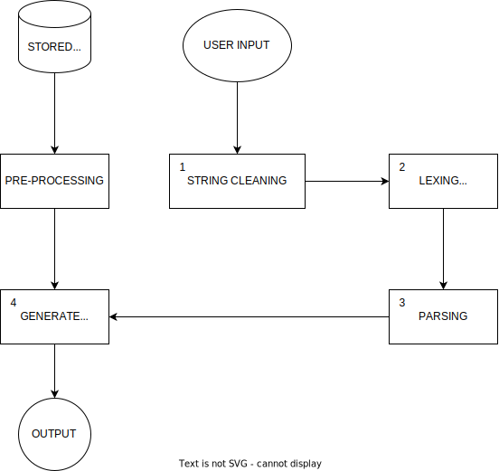

# Welcome to **_Chat-astrophe_**

# Table of Contents

1. [What is **_Chat-astrophe_**](#what-is-chat-astrophe)
2. [How it works](#how-it-works)
   - [Outline](#outline)
   - [Description](#description)  

     0. [Data Pre-processing](#0-data-pre-processing)
     1. [String Cleaning](#1-string-cleaning)
     2. [Lexing](#2-lexing)
     3. [Parsing](#3-parsing)
     4. [Generating Output](#4-generating-output)
   - [Summary](#summary)

3. [Tools Used](#tools-used)
4. [How to Use](#how-to-run)
5. [Improvements and Future Work](#improvements-and-future-work)

## What is **_Chat-astrophe_**
Chat-astrophe was developed as a rule-based chatbot for my university's functional programming course. It's designed to handle various user queries using provided data and knowledge. The implementation follows functional programming paradigm concepts. 

*Notably, it received recognition as the best project among several submissions in the course.*

## How it works

### Outline

  

### Description
In this section I will be diving into how **Chat-astrophe** technically works.  
   
0. **DATA PRE-PROCESSING**  
Before anything the program initiates by reading stored data. Subsequently, it undergoes a pre-processing step to transform this data into a usable knowledge base. This knowledge base is then utilized in generating responses to user queries.  
This procedure occurs only during the initial execution of the chatbot. Since the chatbot is not confined to a single topic, it can be applied to various applications based on the data provided. Whether tailored for a university admission Q&A or instructing individuals on swimming techniques, the chatbot adapts its responses accordingly.
______________________
1. **STRING CLEANING**  
The chatbot accepts user input in the form of a string and undergoes a cleaning process to preprocess the text. This cleaning phase involves the removal of punctuation, special characters, and neutral English words that have minimal impact on the overall meaning of the sentence. Furthermore, the text is transformed to lowercase to maintain uniformity and consistency in the data format. The result of this step is a cleaned string ready for further processing.
______________________
2. **LEXING**  
Lexing involves breaking down the cleaned string into a list of individual words. Each word in this list serves as a tokenized unit representing the sentence. During this stage, a specific function is employed to recognize words that should be combined because they are interpreted as a single entity. For instance, combining "good" and "morning" into the phrase "good morning" ensures they are treated as a unified entity in subsequent processing. The primary goal of this step is to improve the accuracy of subsequent analyses.
______________________
3. **PARSING**  
During the parsing phase, the previously lexed list undergoes a process to identify the structure and grammatical components of the sentence. The chatbot endeavors to detect the longest valid sublist within the parsed list, adhering to predefined grammar rules. These rules encompass patterns for valid sentence structures, encompassing the recognition of English verbs, question words, and nouns. The parsing process is designed to extract meaningful units and relationships from the input sentence.
______________________
4. **GENERATING OUTPUT**  
Upon identification of the first longest valid sublist from the input during the parsing process, the sublist is passed to the "generate output" function. This function aims to explore a dataset containing questions and their corresponding responses.  
The dataset follows a structured format where questions are represented as keys, and their associated responses are stored as values. Typically organized as a CSV file or a key-value store, this dataset facilitates matching.  
The function compares the parsed input sublist to the keys in the dataset, searching for an exact match or a subset of the parsed input. String matching, fuzzy matching, or regular expressions are common techniques employed in this search process.  
When a matching key is found, the corresponding response is retrieved from the dataset. In cases where there is no valid sublist grammatically, the chatbot adapts and continues the response generation process. It seeks keywords within the user's input to identify relevant topics or intents. These keywords then guide the search in the dataset for potential responses or prompt the chatbot to seek clarification from the user. This adaptive approach ensures responsiveness even when the input doesn't conform to the predefined grammar.  
The generated output, or reply, from the chatbot is considered as the response to the user's input. The objective is to furnish a pertinent and meaningful reply based on the input provided.  
It's important to highlight that the effectiveness of response generation is contingent on the quality and comprehensiveness of the dataset. A diverse and well-curated dataset enhances the chatbot's ability to furnish accurate and contextually relevant responses.
______________________

### Summary  

Overall, the chatbot operates by cleaning and parsing user input, then generates a response by matching the parsed input with a dataset of questions and responses. It aims to provide relevant and contextually appropriate replies based on predefined patterns and data.
______________________

## Tools Used

Language(s):  
-  
_We had to use a functional programming language_  
So, it was purely built in Ocaml ;(
______________________

## How to Run
 - Download Ocaml and get it working(Goodluck soldier!)  
   - I recommend using vscode
   - This might help [OCaml Platform Extension](https://marketplace.visualstudio.com/items?itemName=ocamllabs.ocaml-platform) 

 - Download or clone the repo
 - Run the Chatastrophe.ml file (SRC>Chatastrophe.ml)
 - csv files should be in the same directory of the files
 - If you modify the csv re-run the program to read the new data
    - To change the chatbot's knowledge modify GenerateOutput.csv
    - Use the same format you'll find in the csv file
 ______________________

## Improvements and Future Work
This section is some possible improvements that I will be working on in the future and for anyone who would like to do so.
1. **Expand Grammar Rules:**
   - Explore and define additional grammar rules to accommodate a broader range of sentence structures.

2. **Enhance Dataset:**
   - Increase the size and diversity of the dataset to improve response coverage and accuracy.

3. **Integrate NLP Techniques:**
   - Investigate and incorporate Natural Language Processing (NLP) techniques to enhance language understanding capabilities.

4. **Explore Machine Learning Approaches:**
   - Investigate the potential of machine learning approaches to further refine and improve response generation.

5. **Connect Back End with UI:**
   - Establish a connection between the back end and the user interface (UI) for a seamless and integrated user experience.

6. **Implement Context Awareness:**
   - Develop and implement context-awareness mechanisms to enable the chatbot to provide more coherent and contextually relevant responses.  

**Nearly forgot**   
**✨Improvement 0: Picking up a new language.✨** 